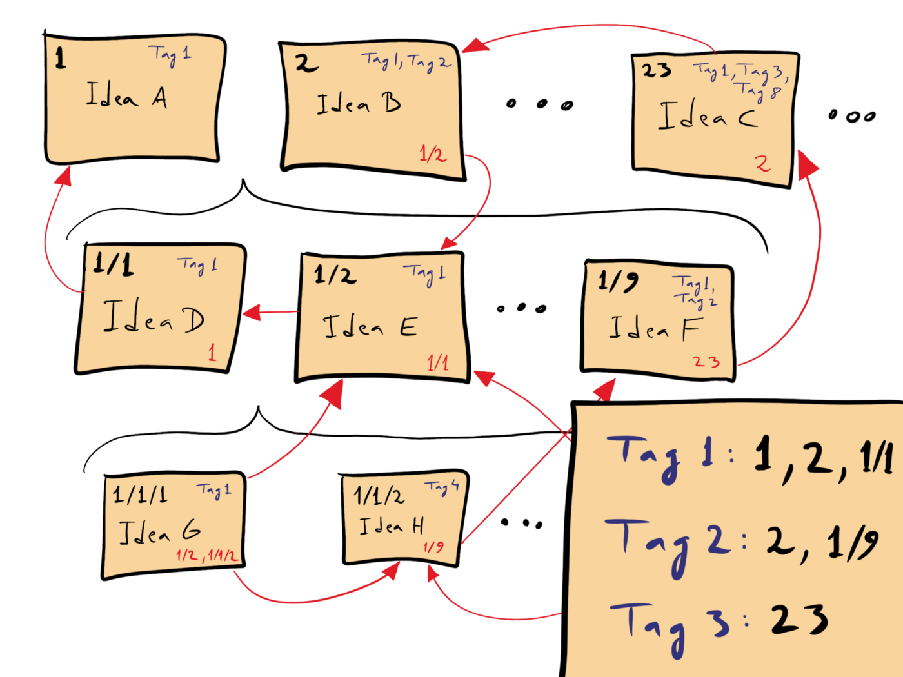

## zk



[](https://github.com/terror/zk/releases/latest)
[](https://crates.io/crates/zk-cli)
[](https://github.com/terror/zk/actions/workflows/ci.yaml)
[](https://deps.rs/repo/github/terror/zk)

A note-taking tool based on the famous *Zettelkasten* method with support for
fuzzy searching, tags & link exploration, in Rust!

## What is a *Zettelkasten*?

A **zettelkasten**, or 'slip box' is a method of note-taking famously used by
the sociologist Niklas Luhmann. Notes essentially contain metadata such as tags
that describe key aspects of the note or links to other notes. The goal is to
enhance creativity by exploring the relationships between notes and
making new connections between seemingly unrelated ideas.

## Features

- Fast fuzzy search and link exploration powered by [skim](https://github.com/lotabout/skim)
- Works with a flat directory of markdown files
- Minimal configuration with sensible defaults

Here is a quick demo showcasing the new, search, tag, link and explore
features.

[](https://asciinema.org/a/4TrHLpcAv9lk0RfGngzS6ft3e)

## Installation

`zk` should run on most systems, including Linux, MacOS, and the BSDs. Windows
support is being worked on!

The easiest way to install it is by using [cargo](https://doc.rust-lang.org/cargo/index.html),
the Rust package manager:

```bash
cargo install zk-cli
```

### Pre-built binaries

Pre-built binaries for Linux, MacOS, and Windows can be found on [the releases
page](https://github.com/terror/zk/releases).

## Usage

The primary way to use `zk` is via the provided command-line interface, for
which help output is provided below:

```present cargo run -- --help
zk-cli 0.1.0
Liam <liam@scalzulli.com>
A note-taking tool based on the famous Zettelkasten method

Usage: zk <COMMAND>

Commands:
  dir      Output the Zettelkasten directory path
  explore  Explore note links
  find     Find notes by tag
  link     Link two notes
  new      Create a new note
  open     Open a note
  rm       Remove a note
  rmtag    Remove a tag from a note
  rmlink   Remove a link between two notes
  search   Fuzzy search notes
  tag      Add a tag to a note
  help     Print this message or the help of the given subcommand(s)

Options:
  -h, --help     Print help
  -V, --version  Print version
```

## Configuration

`zk` currently looks for a configuration file called `.zk.toml` using the
[rust-xdg](https://github.com/whitequark/rust-xdg) crate.

If a configuration file is found it must have the following key-value pairs
set (default values are shown below if no configuration file is present):

```toml
# .zk.toml

# The Zettelkasten directory path.
path = '~/.zk'

# The preferred editor of choice when opening
# and editing notes.
editor = 'vim'
```

## Keybindings

The fuzzy finder `skim` supports the implementation of custom keybindings, this
section documents the custom keybindings that are implemented when using
various commands.

| Command | Keybindings                                                                      |
|---------|----------------------------------------------------------------------------------|
| explore | `<C-e>` - Edit the selected note<br/> `Enter` - Explore the selected notes links |

## Prior Art

- [`srid/neuron`](https://github.com/srid/neuron) - Future-proof note-taking and publishing based on Zettelkasten
- [`AndrewCopeland/zettelkasten`](https://github.com/AndrewCopeland/zettelkasten) - Creating notes with the zettelkasten note taking method and storing all notes on github
- [`sirupsen/zk`](https://github.com/sirupsen/zk) - Zettelkasten on the command-line 📚 🔍
